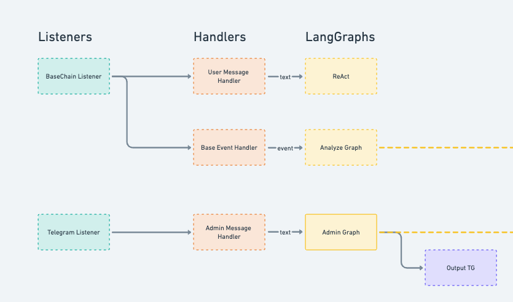

# Architecture

The agent is built on an event-driven architecture with three main components:

### 1. Listeners
Listeners are responsible for listening to events from the outside world and publishing them to the **event bus**.

- **Telegram Listener**: Handles all incoming messages to the bot.

- **OnChain Listener**: Monitors blockchain events and user messages
  - Tracks Morpho Protocol events
  - Processes user messages through on-chain transactions

Each listener has to listen to events, and categorize them into the following types:

- **Admin Message**: Admin commands / questions
- **User Message**: Messages from vault depositors
- **On Chain Event**: Defined on-chain event, like market supply, vault deposit...

### 2. Event Handlers

For each type of event, we have a dedicated handler. This is a simple component that will take an event, link to a graph, execute it, and respond according to event type.

- **AdminMessageHandler**: Handles admin commands / questions
- **UserMessageHandler**: Handles messages from vault depositors
- **OnChainEventHandler**: Handles on-chain events

### 3. Graphs

A graph is a single "flow" of an agent, with a dedicated state.

#### AdminGraph
- **Purpose**: Process admin commands and control agent behavior
- **Flow**:
  - Interpret command intent (research/action)
  - Route to appropriate processor
  - Execute commands or provide analysis

#### UserMessageGraph 
- **Purpose**: Handle user interactions through on-chain messages
- **Flows**:
  - Process user requests
  - Allow simple tool usage like search local vector database, web search...
  - Response to user on UI.

#### AnalyzeGraph
- **Purpose**: Market analysis, monitoring and auto reallocation
- **Capabilities**:
  - Monitor market conditions
  - Analyze vault performance
  - Recommend (Execute) reallocation strategies
  - Notify admin for attention

