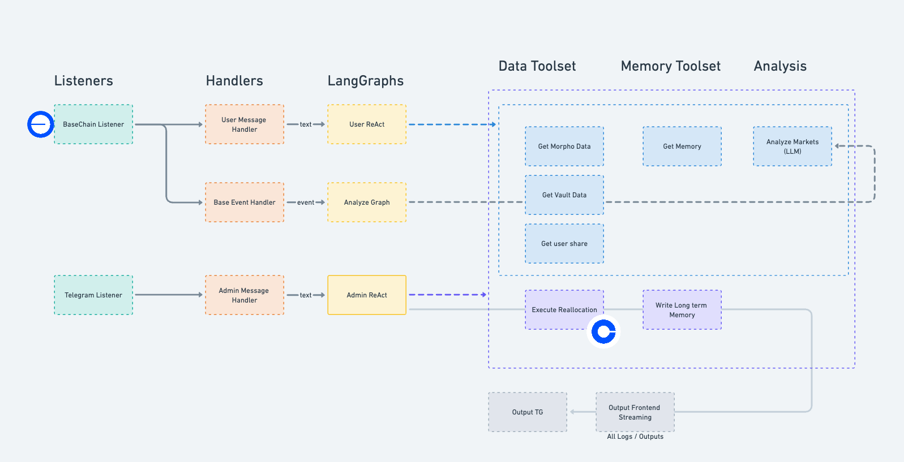

# Wowo Agent 

Wowo Agent is an autonomous agent designed to manage Morpho Protocol vaults through a combination of on-chain monitoring, user interactions, and admin controls. The agent serves as a reallocator in the Morpho Vault, helping to optimize vault strategies and manage positions.

## Core Capabilities

- 🛰️ Monitor on-chain events for relevant morpho markets
- 📥 Process user messages when they deposit/withdraw from the vault
- 🛡️ Handle admin commands
- 📊 Perform market analysis and risk assessment
- 🚀 Execute reallocation transactions

## Tech Stack

- **LangGraph** - All LLM interactions, including 2 ReAct agents with tools
- **Coinbase CDP** - All onchain interactions
- **BaseChain** - All on-chain interactions happens on BaseChain
- **AskBrian** - Extend knowledge base

## Architecture



See [ARCHITECTURE.md](ARCHITECTURE.md) for system design details

## Running the project

1. Install environment and dependencies

```
pip install -r requirements.txt
```

2. Initialize some knowledge into local vector store

```
python scripts/init_morpho_knowledge.py
```

3. Run the Agent

```
python src/main.py
```

